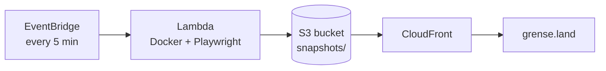

# News Screenshots

Captures scheduled screenshots of news front pages and publishes them as JPEG files to S3. Screenshots are served publicly at [https://grense.land/snapshots](https://grense.land/snapshots).

The app runs every 5 minutes in AWS Lambda (Docker + Playwright), triggered by EventBridge. Infrastructure is defined with AWS CDK.

## Architecture



## Prerequisites

- Python 3.12+
- Docker
- AWS CLI configured with access to your account
- Node.js (for AWS CDK CLI)
- A Route53 hosted zone for `grense.land` in your AWS account

## Configuration

Edit `config.yaml` to define which URLs to capture:

```yaml
urls:
  - url: https://www.vg.no
    name: vg-front
    viewport:
      width: 1920
      height: 1080
    wait_ms: 3000
    full_page: false

screenshot:
  format: jpeg
  quality: 85

storage:
  s3_prefix: snapshots/
  public_base_url: https://grense.land/snapshots

schedule:
  rate_minutes: 5
```

| Setting | Description |
|---------|-------------|
| `urls[].url` | Page to open and screenshot |
| `urls[].name` | Output filename (`{name}.jpg`) |
| `urls[].viewport` | Browser viewport size |
| `urls[].wait_ms` | Extra wait after page load (ms) |
| `urls[].full_page` | Capture full scrollable page |
| `screenshot.quality` | JPEG quality (1–100) |
| `storage.s3_prefix` | S3 key prefix (matches `/snapshots` URL path) |
| `schedule.rate_minutes` | Run interval in AWS (default: 5) |

Copy `config.yaml.example` as a starting point.

## Run locally

Local runs save screenshots to `./output/snapshots/` instead of uploading to S3.

```bash
# Create virtual environment
python3 -m venv .venv
source .venv/bin/activate
pip install -r requirements.txt
playwright install chromium

# Optional: copy environment file
cp .env.example .env

# Run once
python run_local.py
```

Screenshots appear under `output/snapshots/`. To test real S3 uploads locally, unset `LOCAL_OUTPUT_DIR` and set `S3_BUCKET` plus AWS credentials.

### Run in Docker locally

```bash
docker build -t news-screenshots .
docker run --rm \
  -e LOCAL_OUTPUT_DIR=/tmp/output \
  -e S3_BUCKET= \
  -v "$(pwd)/output:/tmp/output" \
  news-screenshots \
  python -c "from handler import run_task; print(run_task())"
```

## Environment variables

| Variable | Required | Description |
|----------|----------|-------------|
| `LOCAL_OUTPUT_DIR` | Local only | Save files locally instead of S3 |
| `S3_BUCKET` | AWS | Target bucket (set automatically in Lambda) |
| `S3_PREFIX` | No | S3 key prefix (default: `snapshots/`) |
| `PUBLIC_BASE_URL` | No | Public URL base for logs |
| `CONFIG_PATH` | No | Path to config file |
| `CDK_DEFAULT_ACCOUNT` | CDK deploy | AWS account ID |
| `CDK_DEFAULT_REGION` | CDK deploy | AWS region (default: `eu-north-1`) |
| `DOMAIN_NAME` | CDK deploy | Domain name (default: `grense.land`) |
| `IMAGE_TAG` | CI deploy | Docker image tag for Lambda |
| `GITHUB_REPOSITORY` | CDK deploy | e.g. `your-org/news-screenshots` (creates OIDC deploy role) |

Example `.env` file:

```env
LOCAL_OUTPUT_DIR=./output
CDK_DEFAULT_ACCOUNT=123456789012
CDK_DEFAULT_REGION=eu-north-1
DOMAIN_NAME=grense.land
```

## Deploy to AWS

### First-time setup

1. Ensure `grense.land` has a Route53 hosted zone in your AWS account.
2. Configure AWS CLI: `aws configure` or `aws sso login`.
3. Run the initial deploy script:

```bash
export CDK_DEFAULT_ACCOUNT=123456789012
export CDK_DEFAULT_REGION=eu-north-1
export GITHUB_REPOSITORY=your-org/news-screenshots  # optional, for GitHub Actions OIDC
chmod +x scripts/initial-deploy.sh
./scripts/initial-deploy.sh
```

This creates:

- S3 bucket for screenshots
- ECR repository `news-screenshots`
- Lambda function (Docker image built from `Dockerfile`)
- EventBridge schedule (every 5 minutes)
- ACM certificate (us-east-1) + CloudFront distribution
- Route53 A record for `grense.land` → CloudFront
- GitHub OIDC deploy role (if `GITHUB_REPOSITORY` is set)

**Note:** The CDK stack creates an A record for the apex domain `grense.land`. If you already use this domain for another website, adjust the CDK stack before deploying.

### Manual CDK deploy

```bash
cd cdk
pip install -r requirements.txt
npm install -g aws-cdk

export CDK_DEFAULT_ACCOUNT=123456789012
export CDK_DEFAULT_REGION=eu-north-1

cdk bootstrap aws://$CDK_DEFAULT_ACCOUNT/$CDK_DEFAULT_REGION
cdk bootstrap aws://$CDK_DEFAULT_ACCOUNT/us-east-1
cdk deploy --all
```

### Invoke Lambda manually

```bash
aws lambda invoke \
  --function-name news-screenshots \
  --region eu-north-1 \
  /tmp/response.json && cat /tmp/response.json
```

## GitHub Actions

On push to `main`, the workflow builds the Docker image, pushes to ECR, and deploys with CDK.

### Setup

1. Create a GitHub repository and push this code.
2. After the first CDK deploy with `GITHUB_REPOSITORY` set, add these **repository secrets**:
   - `AWS_ACCOUNT_ID` — your AWS account ID
   - `AWS_DEPLOY_ROLE_ARN` — from stack output `GitHubDeployRoleArn`
3. Push to `main` to trigger deployment.

## Project structure

```
├── config.yaml              # URL list and settings
├── src/
│   ├── handler.py           # Lambda entry point
│   ├── screenshot.py        # Playwright capture logic
│   ├── storage.py           # S3 / local file persistence
│   └── config.py            # Config loader
├── Dockerfile               # Lambda container image
├── run_local.py             # Local test runner
├── cdk/                     # AWS CDK infrastructure
└── .github/workflows/       # CI/CD
```

## License

MIT
