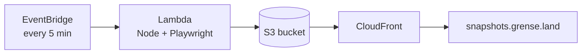

# News Screenshots

Captures scheduled screenshots of news front pages and publishes them as JPEG files to S3. Screenshots are served publicly at [https://snapshots.grense.land](https://snapshots.grense.land).

The app runs every 5 minutes in AWS Lambda (Node.js + Playwright in Docker), triggered by EventBridge. Infrastructure is defined with AWS CDK (Python).

## Architecture



## Prerequisites

- Node.js 20+
- Docker
- AWS CLI configured with access to your account
- Python 3.12+ and Node.js (for AWS CDK CLI)
- A Route53 hosted zone for `grense.land` in your AWS account

## Configuration

Edit `config.json` to define which URLs to capture:

```json
{
  "urls": [
    {
      "url": "https://www.vg.no",
      "name": "vg-front",
      "viewport": { "width": 1920, "height": 1080 },
      "waitMs": 3000,
      "fullPage": false
    }
  ],
  "screenshot": {
    "format": "jpeg",
    "quality": 85
  },
  "storage": {
    "s3Bucket": "",
    "s3Prefix": "",
    "publicBaseUrl": "https://snapshots.grense.land"
  },
  "schedule": {
    "rateMinutes": 5
  }
}
```

| Setting | Description |
|---------|-------------|
| `urls[].url` | Page to open and screenshot |
| `urls[].name` | Output filename (`{name}.jpg`) |
| `urls[].viewport` | Browser viewport size |
| `urls[].waitMs` | Extra wait after page load (ms) |
| `urls[].fullPage` | Capture full scrollable page |
| `screenshot.quality` | JPEG quality (1–100) |
| `storage.s3Prefix` | Optional S3 key prefix |
| `storage.publicBaseUrl` | Public URL base for served images |
| `schedule.rateMinutes` | Run interval in AWS (default: 5) |

Copy `config.json.example` as a starting point.

## Run locally

Local runs save screenshots to `./output/` instead of uploading to S3.

```bash
npm install
npx playwright install chromium

# Optional: copy environment file
cp .env.example .env

# Run once
npm run capture
```

Screenshots appear under `output/`. To test real S3 uploads locally, unset `LOCAL_OUTPUT_DIR` and set `S3_BUCKET` plus AWS credentials.

### Run in Docker locally

```bash
docker build -t news-screenshots .
docker run --rm \
  -e LOCAL_OUTPUT_DIR=/tmp/output \
  news-screenshots \
  node -e "import('./src/handler.js').then(m => m.runTask()).then(console.log)"
```

## Environment variables

| Variable | Required | Description |
|----------|----------|-------------|
| `LOCAL_OUTPUT_DIR` | Local only | Save files locally instead of S3 |
| `S3_BUCKET` | AWS | Target bucket (set automatically in Lambda) |
| `S3_PREFIX` | No | S3 key prefix (default: empty) |
| `PUBLIC_BASE_URL` | No | Public URL base for logs |
| `CONFIG_PATH` | No | Path to config file (default: `config.json`) |
| `CDK_DEFAULT_ACCOUNT` | CDK deploy | AWS account ID |
| `CDK_DEFAULT_REGION` | CDK deploy | AWS region (default: `eu-north-1`) |
| `HOSTED_ZONE_NAME` | CDK deploy | Route53 zone (default: `grense.land`) |
| `DOMAIN_NAME` | CDK deploy | Subdomain for snapshots (default: `snapshots.grense.land`) |
| `IMAGE_TAG` | CI deploy | Docker image tag for Lambda |
| `GITHUB_REPOSITORY` | CDK deploy | e.g. `seventor/web-snapshots` (creates OIDC deploy role) |

Example `.env` file:

```env
LOCAL_OUTPUT_DIR=./output
CDK_DEFAULT_ACCOUNT=123456789012
CDK_DEFAULT_REGION=eu-north-1
HOSTED_ZONE_NAME=grense.land
DOMAIN_NAME=snapshots.grense.land
```

## Deploy to AWS

### First-time setup

1. Ensure `grense.land` has a Route53 hosted zone in your AWS account.
2. Configure AWS CLI: `aws configure` or `aws sso login`.
3. Run the initial deploy script:

```bash
export CDK_DEFAULT_ACCOUNT=123456789012
export CDK_DEFAULT_REGION=eu-north-1
export GITHUB_REPOSITORY=seventor/web-snapshots
chmod +x scripts/initial-deploy.sh
./scripts/initial-deploy.sh
```

This creates:

- S3 bucket for screenshots
- ECR repository `news-screenshots`
- Lambda function (Docker image built from `Dockerfile`)
- EventBridge schedule (every 5 minutes)
- ACM certificate (us-east-1) + CloudFront distribution
- Route53 A record for `snapshots.grense.land` → CloudFront
- GitHub OIDC deploy role (if `GITHUB_REPOSITORY` is set)

The apex domain `grense.land` is not modified — only the `snapshots` subdomain is added.

### Manual CDK deploy

```bash
cd cdk
pip install -r requirements.txt
npm install -g aws-cdk

export CDK_DEFAULT_ACCOUNT=123456789012
export CDK_DEFAULT_REGION=eu-north-1
export HOSTED_ZONE_NAME=grense.land
export DOMAIN_NAME=snapshots.grense.land

cdk bootstrap aws://$CDK_DEFAULT_ACCOUNT/$CDK_DEFAULT_REGION
cdk bootstrap aws://$CDK_DEFAULT_ACCOUNT/us-east-1
cdk deploy --all
```

### Invoke Lambda manually

```bash
aws lambda invoke \
  --function-name news-screenshots \
  --region eu-north-1 \
  /tmp/response.json && cat /tmp/response.json
```

## GitHub Actions

On push to `main` or `master`, the workflow builds the Docker image, pushes to ECR, and deploys with CDK.

### Setup

1. Push this code to [seventor/web-snapshots](https://github.com/seventor/web-snapshots).
2. After the first CDK deploy with `GITHUB_REPOSITORY` set, add these **repository secrets**:
   - `AWS_ACCOUNT_ID` — your AWS account ID
   - `AWS_DEPLOY_ROLE_ARN` — from stack output `GitHubDeployRoleArn`
3. Push to `main` or `master` to trigger deployment.

## Project structure

```
├── config.json              # URL list and settings
├── package.json
├── src/
│   ├── handler.js           # Lambda entry point
│   ├── screenshot.js        # Playwright capture logic
│   ├── storage.js           # S3 / local file persistence
│   └── config.js            # Config loader
├── Dockerfile               # Lambda container image
├── run-local.js             # Local test runner
├── cdk/                     # AWS CDK infrastructure
└── .github/workflows/       # CI/CD
```

## License

MIT
